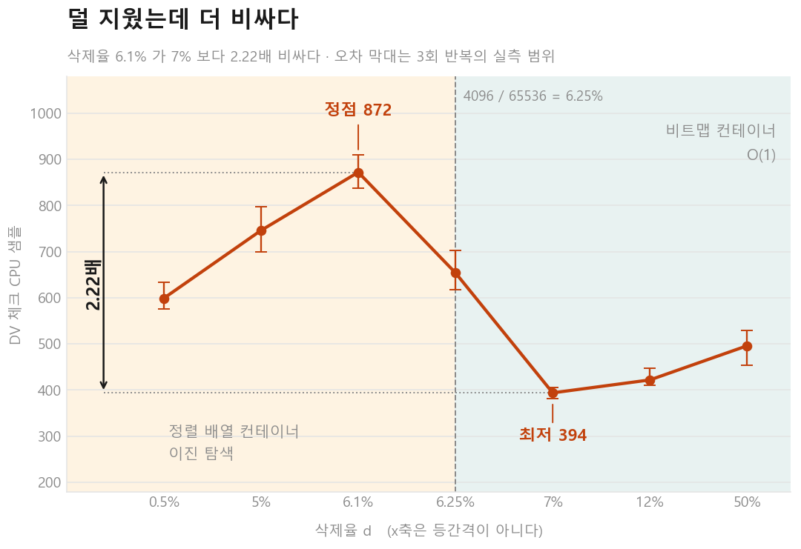
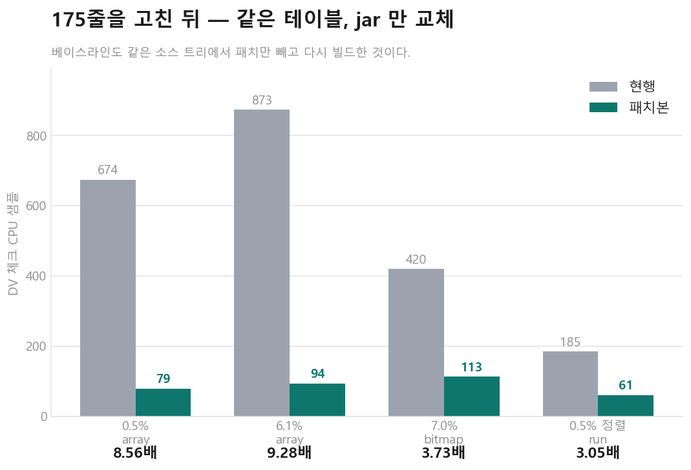
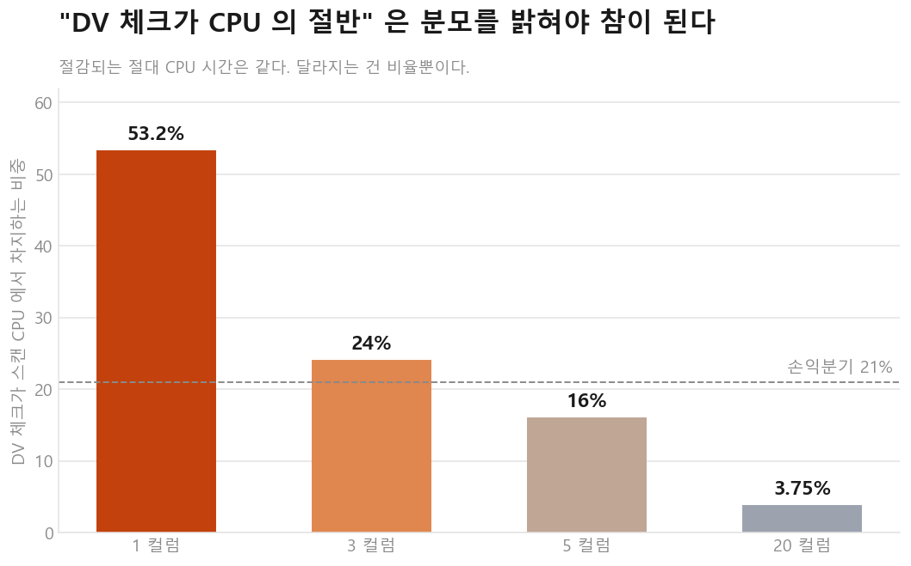

# 삭제를 더 많이 했는데 스캔이 빨라진 이유

## Apache Iceberg V3 Deletion Vector 를 따라가며 확인한 것들

---

> Iceberg V3 의 deletion vector 는 삭제율이 6.25% 를 넘을 때 내부 자료구조가 바뀐다.
> 그래서 경계 바로 아래가 오히려 가장 비쌌다. 좁은 스캔에서는 이 확인 작업이 CPU 의
> 절반을 차지했다. 175줄짜리 변경으로 최악 조건의 비용을 9.28배 줄였고,
> 실험을 이어가는 동안 내 예상은 **19번 틀렸다.**
>
> 패치는 [apache/iceberg#18027](https://github.com/apache/iceberg/pull/18027) 로
> 올려뒀다. PR 이 어떻게 결론 나든, 아래의 측정값과 그 과정은 그대로 남는다.

처음에는 deletion vector 가 느린 이유를 컨테이너 타입 하나로 설명할 수 있을 거라
생각했다. 실제로는 읽는 경로까지 따라가야 했다. 실험별 숫자는
[전체 측정 기록](findings.md), 진행 순서는 [서사 문서](STORY.md)에 남겨뒀다.

---

# 1. 서론

## 1.1 문제를 발견하게 된 배경

Merge-on-read 테이블에서 행을 지우면 Iceberg 는 데이터 파일을 다시 쓰지 않는다.
대신 "이 파일의 몇 번째 행이 지워졌다"를 따로 적어 옆에 둔다. 쓰기 비용을 낮추는
대신 읽을 때 비용이 붙는 구조다.

Iceberg V3 에서는 그 기록이 **deletion vector**(이하 DV)가 됐다. 파일 하나당
비트맵 하나로, 지워진 행 위치를 담는다. 읽을 때는 행마다 `isDeleted(position)` 을
물어보고 살아남은 행만 통과시킨다.

확인하고 싶었던 것은 단순했다.

> **이 확인 작업의 비용은 실제로 얼마인가. 그리고 무엇에 따라 달라지는가.**

DV 는 V3 에서 새로 들어온 구조라 실측 자료가 많지 않았다. 그래서 직접 재기로 했다.

## 1.2 처음 예상했던 원인

측정을 시작하기 전에 예상을 적어뒀다. 두 가지였다.

**첫째, 삭제가 많을수록 읽기도 느려질 것이다.** 비트맵이 커지고 확인할 위치도
많아지니 자연스러운 예상이었다.

**둘째, 비용을 가르는 것은 Roaring bitmap 의 컨테이너 타입일 것이다.** 정렬 배열은
이진 탐색이라 분기 예측 실패가 많을 테고, 비트맵은 상수 시간이니 쌀 것이다.

두 예상 모두 틀렸다. 첫 번째는 곡선을 그리자마자 깨졌고, 두 번째는 하드웨어 카운터를
찍고 나서 깨졌다. 이 글은 그 두 번의 수정을 따라가는 순서로 쓴다.

## 1.3 성능 테스트를 시작하다

측정에 들어가기 전에 규칙 세 가지를 먼저 정했다. 나중에 이 규칙들이 결론을 몇 번
뒤집었기 때문에, 순서상 여기 적어둔다.

**측정 전에 예측을 적는다.** 모든 실험 스크립트의 헤더에 예측을 먼저 쓰고, 채점
도구는 그 예측을 다시 적지 않는다. 채점 쪽에도 적어두면 결과를 본 뒤에 조용히
고칠 수 있게 된다.

**노이즈 바닥보다 작은 차이는 주장하지 않는다.** 처음에는 노이즈를 Poisson 근사
`±√n` 으로 추정하고 "350 ± 19 이므로 명확히 분리됨" 이라고 적었다. 같은 설정을
실수로 두 번 재보니 실제 흩어짐은 20~41% 였다. 두 배가 아니라 자릿수가 틀렸다.
모든 설정을 3회 이상 반복해 다시 쟀고, 흩어짐 중앙값 **9.7%** 를 확정한 뒤
그보다 작은 차이는 주장하지 않기로 했다.

**게이트는 로그가 아니라 산출물을 센다.** `"완료 (0초)"` 는 거짓말을 한다. 스크립트가
아무것도 안 하고 성공으로 끝날 수 있다. 그래서 모든 게이트가 파일 수, 행 수,
컨테이너 수를 직접 센다.

DV 파일을 직접 읽는 도구도 먼저 만들었다. Iceberg 가 쓴 Puffin 파일에서 Roaring
비트맵을 꺼내 청크별 컨테이너 타입과 카디널리티를 출력하는 파서다. 명세와 대조해
검증했고, 실제 Spark/Iceberg 가 쓴 출력에서도 동작을 확인했다. 이 도구가 없었으면
"컨테이너가 바뀌었다"를 추측으로만 말해야 했다.

---

# 2. 본론

## 2.1 Iceberg V3의 Deletion Vector

### Row-level Delete

테이블 포맷에서 행 하나를 지우는 방법은 두 가지다.

| | 방식 | 쓰기 | 읽기 |
|---|---|---|---|
| **copy-on-write** | 데이터 파일을 통째로 다시 쓴다 | 비싸다 | 싸다 |
| **merge-on-read** | "지워졌다"는 표시를 옆에 둔다 | 싸다 | 비용이 붙는다 |

이 글에서 보는 것은 merge-on-read 쪽의 "읽기 비용" 이 어디에서 생기는지다.

### Position Delete / Equality Delete

V2 에는 표시하는 방법이 두 가지 있었다.

| | 무엇으로 지목하나 | 읽을 때 |
|---|---|---|
| **position delete** | 파일 + 몇 번째 행 | 위치만 비교하면 된다 |
| **equality delete** | 컬럼 값 (`user_id = 12345`) | 실제 값을 읽어서 비교해야 한다 |

position delete 는 지운 위치를 행마다 한 줄씩 파일에 적는다. 삭제가 많아지면 그 파일
자체가 커지고, 읽을 때 정렬·병합하는 비용도 같이 커진다.

equality delete 는 값 기준이라 리더가 실제 컬럼을 읽어 조건을 맞춰봐야 한다.

### Deletion Vector

V3 의 deletion vector 는 position delete 의 목록을 비트맵 하나로 바꾼 것이다.

```text
data-file-a.parquet
        │
        └── deletion vector
                 └── 지워진 행 위치들의 비트맵
```

파일당 DV 는 최대 하나다. 그래서 리더가 파일 하나를 열 때 병합할 삭제 파일이 여러 개
널려 있지 않고, "이 파일에 대한 비트맵 하나" 만 보면 된다.

equality delete 는 V3 에도 그대로 남아 있다. 값을 봐야 판정되는 삭제는 위치로
바꿔칠 수 없기 때문이다. 이 구분은 뒤에서 패치의 적용 범위를 정할 때 다시 나온다.

### Roaring Bitmap

DV 의 비트맵 구현이 Roaring bitmap 이다. 이름은 비트맵인데, 값 전체를 하나의 거대한
비트 배열로 들고 있지는 않다.

32비트 값 공간을 상위 16비트로 잘라 **청크**로 나눈다. 청크 하나가 담당하는 범위는
`2^16 = 65,536` 개다. 그리고 청크마다 자료구조를 따로 고른다.

| 컨테이너 | 저장 방식 | 조회 |
|---|---|---|
| `array` | 정렬된 16비트 배열 | 이진 탐색 `O(log n)` |
| `bitmap` | 8KB 고정 비트 배열 | 비트 테스트 `O(1)` |
| `run` | 연속 구간을 `(시작, 길이)` 로 압축 | 구간 이진 탐색 |

고르는 기준이 중요하다. 청크에 든 원소가 **4,096개 이하면 `array`, 넘으면 `bitmap`**
이다. 값 하나에 2바이트씩 쓰는 배열이 8KB 고정 비트맵보다 작아지는 지점이 거기다.

```text
4,096 / 65,536 = 0.0625 = 6.25%
```

직접 만든 파서로 확인해도 그대로였다. 4,096개는 `array`, 4,097개는 `bitmap` 이다.

한 가지 더 확인한 것이 있다. **삭제가 전혀 없는 청크에는 컨테이너가 아예 존재하지
않는다.** 연속 30% 를 지운 테이블에서 60만 행의 삭제가 60바이트로 저장됐고, 청크
0~9 와 20~30 에는 컨테이너가 없었다. 이 성질이 나중에 정렬 처방을 설명할 때 쓰인다.

---

## 2.2 성능 문제 재현

### 삭제율별 성능

8백만 행 테이블에 삭제율만 바꿔가며 프로파일을 찍었다. 곡선이 이렇게 나왔다.

| 삭제율 d | DV 체크 샘플 (범위) | |
|---|---|---|
| 0.50% | 599 (576–633) | |
| 5.00% | 746 (700–798) | 오르막 |
| **6.10%** | **872 (838–909)** | ← **정점** |
| 6.25% | 654 (617–702) | 절벽 |
| **7.00%** | **394 (381–406)** | ← **최저** |
| 12.00% | 422 (410–447) | |
| 50.00% | 496 (454–529) | 다시 오름 |



**삭제율 6.1% 가 7% 보다 2.22배 비싸다.** 더 적게 지웠는데 더 비쌌다.
6.4~7% 근처에는 비용이 유난히 낮은 구간도 있었다.

첫 번째 예상이 여기서 깨졌다.

### 6.25% 경계

컨테이너 전환점과 곡선의 절벽이 같은 자리였다. 삭제율이 청크 밀도 6.25% 를 넘으면
컨테이너가 `array` → `bitmap` 으로 바뀌고, 조회가 이진 탐색에서 비트 테스트가 된다.

경계 바로 아래인 d=6.1% 가 비싼 것도 같은 이유다. 이때 `array` 의 카디널리티가
최대(3,998)에 가까워 이진 탐색이 가장 깊어진다. 더 삭제하면 `bitmap` 으로 넘어간다.

전이 구간의 폭도 쟀다. 이항분포로 예측한 값과 **3.7%p 이내**로 맞았다.
청크마다 카디널리티가 조금씩 다르니 경계가 한 점이 아니라 0.30%p 폭으로 번진다.

> 위 표에서 6.25% 와 7% 사이(6.4%)를 뺀 것은 의도적이다. 재보면 455 가 나오는데,
> 7%(394)와의 차이가 15.5% 로 노이즈 바닥 바로 위이고 **그 점의 흩어짐이 25.9% 로
> 전체 측정에서 가장 나빴다.** 두 점의 순서를 주장할 수 없어 곡선에서 뺐다.

### 같은 삭제율인데 다른 성능

여기까지만 보면 컨테이너 타입이 비용을 정한다고 볼 만했다.

그래서 삭제율을 고정하고 다른 것을 바꿨다. 0.5% 를 그대로 둔 채, 지워진 위치가
얼마나 뭉쳐 있는지만 바꿨다. **3.53배 차이가 났다.** 삭제율도, 지운 행 수도 같은데.

처음에는 `run` 컨테이너 덕이라고 생각했다. 뭉쳐 있으면 연속 구간으로 압축되니까.
그런데 **컨테이너 타입을 똑같이 유지한 채 삭제가 존재하는 청크 수만 줄여도 2.22배**가
나왔다. `run` 은 주된 이유가 아니었다.

비용에는 여러 조건이 함께 작용하고 있었다.

```text
삭제율          ─┐
청크 내부 밀도   ─┤
삭제 위치의 뭉침 ─┼→ DV 체크 비용
컨테이너 타입    ─┘
```

한동안은 DV 비용 자체가 여러 변수의 복잡한 조합이라고 생각했다. 읽는 경로를
확인하고 나서 그 생각을 바꿨다.
---

## 2.3 원인 추적

### Roaring Bitmap 분석과 Container 구조

먼저 자료구조 자체를 재봤다. 컨테이너 타입별로 행당 삭제 체크 비용을 마이크로벤치로
분리하면 **약 4배** 차이가 났다. `array` 가 가장 비싸고 `bitmap` 이 가장 쌌다.

Iceberg 의 래퍼(`BitmapPositionDeleteIndex`)가 RoaringBitmap 을 직접 호출하는 것보다
얼마나 더 드는지도 쟀다. **1.1~2.8배** 였다. 즉 래퍼 자체도 공짜는 아니지만, 곡선의
2.22배를 설명할 정도는 아니었다.

### Profiler

마이크로벤치 결과가 실제 쿼리에서도 유지되는지가 중요했다. 자료구조 벤치에서 4배가
나도, 그게 전체 스캔의 1% 라면 고칠 이유가 없다. 암달의 법칙이 이 프로젝트의 가장 큰
리스크였다.

그래서 실제 Spark 쿼리를 async-profiler 로 찍었다. **좁은 스캔에서 DV 체크가 스캔
CPU 의 40% 를 차지했다.** 미리 정해둔 게이트 기준(5%)을 크게 넘겼다.

그리고 프로파일에서 한 가지가 더 보였다. **컨테이너 타입이 바뀌면 프로파일에 뜨는
함수 이름이 바뀐다.** 마이크로벤치에서 본 것과 같은 현상이 실제 쿼리 경로에서도
일어나고 있다는 교차 확인이었다.

다만 이 40% 라는 숫자에는 조건이 붙는다. 반드시 "좁은 스캔에서" 를 붙여야 한다.
왜 그런지는 2.6 에서 다시 다룬다.

### Spark Vectorized Reader

다음 질문은 Spark 가 이 비트맵을 실제로 어떻게 읽는지였다.

`ColumnarBatchUtil` 이다. Spark 의 벡터화 리더가 배치 하나를 처리할 때, 살아남은 행의
번호를 새로 매기기 위해 이렇게 돈다.

```java
for (int rowId = 0; rowId < batchSize; rowId++) {
  long pos = rowStartPosInBatch + rowId;
  if (!deletedPositions.isDeleted(pos)) {
    rowIdMapping[live++] = rowId;
  }
}
```

`_deleted` 같은 메타데이터 컬럼을 투영하는 경로에는 `buildIsDeleted` 가 따로 있는데,
구조는 같다. 행마다 한 번씩 묻는다.

### isDeleted() 호출 구조

배치 기본 크기가 5,000행이니 **배치마다 5,000번의 독립적인 조회**가 발생한다.

그리고 `isDeleted(pos)` 한 번은 불리언 배열 조회가 아니다. Roaring 에서는 매번 이
일을 처음부터 다시 한다.

```text
pos
 └→ 상위/하위 키로 분리
     └→ 비트맵 배열 범위 검사
         └→ 컨테이너 배열 이진 탐색
             └→ 컨테이너 안에서 멤버십 검사
```

배치 전체가 같은 컨테이너 한두 개에 걸리는 경우에도 앞의 세 단계를 5,000번 반복한다.
한 번 찾은 컨테이너 정보를 다음 행에서 활용하지 못하고 있었다.

이 구조가 2.2 에서 본 축들을 다시 설명한다. 청크가 여러 개로 흩어지면 컨테이너
배열이 길어져 이진 탐색이 깊어진다. 뭉쳐 있으면 짧다. 3.53배도, 2.22배도 결국
행마다 반복하는 그 탐색이 얼마나 깊으냐의 문제였다. 컨테이너 타입은 마지막 한
단계일 뿐이었다.

---

## 2.4 병목의 정체

### ColumnarBatch의 연속적인 position

문제는 `pos` 가 무작위가 아니라는 점이다. 배치가 읽는 위치는 이미 연속 단조 증가다.

```text
실제로 물어보는 것        알고 있는 것
isDeleted(100)
isDeleted(101)
isDeleted(102)     →      [100, 5100) 구간 전체
   ...
isDeleted(5099)
```

리더는 "이번 배치는 position 100번부터 5,099번까지" 라는 사실을 이미 알고 있다.
그런데 그 정보가 인덱스까지 전달되지 않는다.

### Row-by-row probe

같은 컨테이너를 5,000번 다시 찾는 구조다. 상위/하위 키 분리, 배열 범위 검사,
컨테이너 이진 탐색이 배치 내내 같은 답을 내놓는데도 행마다 반복된다.

성능 문제를 볼 때 분기 예측 실패나 캐시 미스를 먼저 떠올리기 쉬운데, 이 경우에는
그보다 앞선 문제가 있었다. **한 번 물어봐도 되는 것을 5,000번 물어보고 있었다.**

### Range traversal이 가능한 이유

여기서 한 가지를 분명히 해둘 필요가 있다. 이 최적화는 **"DV 에 저장된 위치가
정렬되어 있다"** 는 성질에 기대는 것이 아니다.

기대는 것은 **리더가 처리하는 행 위치가 연속 구간이라는 성질**이다. 그 구간을 그대로
넘기면 인덱스 쪽에서 컨테이너를 한 번만 찾아 끝까지 훑을 수 있다.

그리고 RoaringBitmap 에는 이미 구간 기반 순회 API 가 있다. 새 자료구조를 만들거나
Roaring 을 고칠 필요가 없었다.

구간 API 로 얼마나 줄어드는지는 패치를 쓰기 전에 마이크로벤치로 먼저 확인했다.
컨테이너와 분포에 따라 **6~146배** 범위였다.

### 구간 API 가 하나가 아니다

여기서 고를 게 남아 있었다. RoaringBitmap 이 주는 방법이 하나가 아니라서,
여섯 구현을 같은 조건으로 재고 골랐다.

| 구현 | 0.5% | 5% | 12% |
|---|---|---|---|
| 현행 (행마다 `isDeleted`) | 64.99 | 80.22 | 19.76 |
| `forAllInRange` + `RelativeRangeConsumer` | **0.49** | **1.91** | **3.07** |
| `forEachInRange` + 빈틈 채우기 | 0.45 | 1.87 | 4.16 |
| `BatchIterator` | 0.63 | 2.79 | 5.92 |

(µs, 낮을수록 좋다. `run` 컨테이너 열은 뺐다 — 배치가 통째로 삭제되는 퇴화
케이스라 3,992배 같은 값이 나오고, 인용하지 않기로 한 숫자다.)

**`BatchIterator` 가 가장 느리다.** 이름만 보면 제일 배치 친화적일 것 같은데
그렇지 않다. `nextBatch(int[])` 는 삭제된 위치를 버퍼로 돌려주므로 매핑을 만드는
**두 번째 패스**가 필요하다. `forEachInRange` 는 훑으면서 매핑에 바로 쓰기 때문에
삭제 위치가 아예 물화되지 않는다.

그리고 `forAllInRange` 가 가장 빠른 이유는 **`acceptAllAbsent(from, to)`** 다.
삭제가 없는 구간을 O(1) 로 건너뛴다. `run` 컨테이너에서는 이것만으로
`forEachInRange` 보다 2.7배 빨랐다.

그런데 **채택한 건 가장 빠른 쪽이 아니라 `forEachInRange` 다.**
`RelativeRangeConsumer` 는 없는 위치까지 통보하고 벌크 콜백을 두 개 더 갖는 인터페이스라,
`PositionDeleteIndex` 를 통해 밖으로 드러내기에는 표면이 넓다. 게다가
`RoaringBitmap.forEachInRange` 자체가 내부적으로 `forAllInRange` 에 어댑터를 씌워
위임하므로, 작은 쪽을 골라도 이득의 대부분은 따라온다.

**둘의 차이보다 현행과의 차이가 훨씬 크다** — 0.45 대 0.49 의 차이를 지키려고
공개 인터페이스를 넓힐 이유가 없었다. 셋 다 현행 대비 두 자릿수 배다.

> 이 마이크로벤치 숫자에는 정정이 하나 붙어 있다. 처음 `run` 컨테이너에서
> **3,992배**가 나왔는데, 이건 퇴화된 조건이었다. 정직한 숫자는 **56~150배** 다.
> 그리고 벤치를 RoaringBitmap 1.6.20 으로 돌렸는데 Iceberg 1.11.0 이 핀한 것은
> 1.6.14 였다. 두 버전 모두 필요한 API 를 갖고 있어 결론은 바뀌지 않았지만,
> 버전을 확인하지 않고 쟀던 것은 사실이다.

---

## 2.5 해결

### Range-based traversal

변경의 핵심은 배치가 이미 알고 있는 구간을 API 에 그대로 전달하는 것이다.

`PositionDeleteIndex` 에 구간 순회 메서드를 하나 추가했다.

```java
default void forEachInRange(long posStart, int length, LongConsumer consumer)
```

`default` 구현은 지금의 행 단위 루프 그대로다. 그래서 이 인터페이스를 구현한 바깥
코드는 아무것도 안 고쳐도 계속 돈다. 그리고 실제로 쓰이는 구현체만 재정의한다.

```text
PositionDeleteIndex
   ├── BitmapPositionDeleteIndex → 구간을 32비트 비트맵 최대 2개로 좁혀 한 번씩 훑는다
   ├── EmptyPositionDeleteIndex  → 아무것도 안 한다
   └── (그 외)                    → 기본 구현, 즉 기존 동작
```

`PositionDeleteIndex` 는 이미 `merge`, `forEach`, `cardinality`, `serialize` 를
`default` 메서드로 넓혀온 인터페이스다. 같은 방식을 따랐다.

### buildRowIdMapping

`ColumnarBatchUtil` 은 삭제된 위치만 받아 그 사이를 순서대로 채운다. 컨테이너를 찾는
앞의 단계는 행마다가 아니라 배치마다 수행된다.

### buildIsDeleted

`_deleted` 를 투영하는 경로는 더 단순하다. 살아남은 행을 앞으로 당길 필요가 없어서,
구간을 훑으며 삭제된 위치만 표시하면 끝난다. 그래서 개선폭도 더 크다.

### Equality Delete 경로 유지

패치는 삭제 경로 전체를 바꾸지 않는다. DV·position delete 만 구간 순회로 가고,
equality delete 는 기존 루프를 그대로 쓴다.

```text
DV / position delete   →  구간 순회 (새 경로)
equality delete        →  행 단위 평가 (그대로)
```

이유는 2.1 에서 이미 나왔다. position 기반 삭제는 위치만 있으면 판정이 끝나므로
구간을 한 번 훑으면 된다. equality delete 는 행의 값을 읽어서 조건을 맞춰봐야 하므로
구간을 안다고 건너뛸 수 있는 게 아니다.

게이트는 `deletes.hasEqDeletes()` 하나다. equality delete 가 있는 테이블에서 회귀가
없다는 것도 따로 확인했다. 코드 경로가 바뀌지 않는 경우도 결과로 남겨뒀다.
---

## 2.6 성능 검증

### Microbenchmark

JMH 로 컨테이너와 분포를 바꿔가며 행 단위 조회와 구간 순회를 비교했다.
컨테이너에 따라 **6~146배**, `run` 컨테이너에서는 **56~150배** 였다.

다만 마이크로벤치는 출력 버퍼를 재사용해 알고리즘만 분리한다. 실제 코드는 배치마다
`new int[batchSize]` 를 할당한다. 그래서 이 숫자는 상한이고, 실제 개선폭은 아래의
Spark 측정이 답이다.

### Spark 실제 환경

`apache-iceberg-1.11.0` 을 클론해 175줄을 고치고 다시 빌드했다. 같은 테이블에 jar 만
바꿔서 쟀다.

| 설정 | 컨테이너 | 현행 | 패치본 | 개선 |
|---|---|---|---|---|
| 0.5% | array | 674 | **79** | **8.56배** |
| **6.1%** | array | **873** | **94** | **9.28배** |
| 7.0% | bitmap | 420 | 113 | 3.73배 |
| 0.5% 정렬 | run | 185 | 61 | 3.05배 |



`_deleted` 투영 경로는 **14.9~18.9배** 로 더 컸다. 빈틈을 채울 필요가 없기 때문이다.
삭제율이 낮을수록 격차가 벌어진다(0.5% → 18.9배, 6.1% → 14.9배).

비교가 성립하도록 베이스라인도 릴리스 jar 을 쓰지 않았다. 같은 소스 트리를 패치만
stash 한 상태로 다시 빌드했다. 두 jar 의 유일한 차이가 이 변경이어야 한다.

배치 크기를 바꿔도 결론이 흔들리는지 확인했다. **20배 범위(1,000~20,000)에서
방향이 유지됐다.** 다만 이 축에서 내가 세운 기전 모델은 틀렸다. 패치본도 살아남은
행마다 `rowIdMapping` 에 써야 하는데, 그 부분을 빼고 모델을 세웠다.

### Scan CPU

DV 체크의 비중은 읽는 컬럼에 따라 크게 달랐다. 따라서 53% 라는 숫자만 따로 말하면
오해하기 쉽다.

| 투영 폭 | DV 체크가 스캔 CPU 에서 차지하는 비중 |
|---|---|
| 1 컬럼 | **53.2%** |
| 3 컬럼 | 24% |
| 5 컬럼 | 16% |
| 20 컬럼 | **3.75%** |



분모(Parquet 디코딩)가 컬럼 수만큼 커지기 때문이다. 그래서 이 글은 큰 쪽만 인용하지
않고 항상 범위로 적는다.

축이 컬럼 수가 아니라는 것도 재서 알았다. 정수 컬럼 10개(21.6%)가 문자열 컬럼
3개(10.6%)보다 비중이 높다. 진짜 축은 컬럼 수가 아니라 **디코딩 비용**이었고,
손익분기는 하나의 숫자로 수렴한다. **DV 가 스캔의 21% 를 넘느냐.**

문자열이 비싼 이유도 따로 쟀다. "문자열이라서" 도 "길이 때문" 도 아니고 둘 다였다.
길이에 대해 적합하면 `1,808 + 61.6 × 길이` (R² 0.95) 로, 컬럼 고정비와 문자당 비용이
둘 다 실재한다. 8자에서는 두 항이 비슷하고, 32자에서는 길이 항이 2:1 로 우세하다.

> 이 적합에는 정정이 붙어 있다. 처음에는 6라운드의 **평균**을 써서 24자 점이 선에서
> 벗어나는 것처럼 보였고, 이상치를 설명하려 했다. 실제로는 한 라운드가 오염된 것이었고
> 이 프로젝트의 다른 도구들처럼 **중앙값**을 쓰면 잔차가 −6.0% 로 노이즈 바닥 안이었다.
> 설명할 이상치는 없었다. 규칙을 코드에 박아뒀는데 이 계산만 손으로 해서 생긴 일이다.

### 환경을 바꿔가며 확인

이 비중이 내 노트북의 성질인지 아닌지가 중요했다. 축을 하나씩 바꿔가며 다시 쟀다.

| 바꾼 것 | 결과 |
|---|---|
| CPU (Zen 3 / Sapphire Rapids / Graviton3) | 49% / 56% / 54% — ±7%p |
| 스토리지 (웜 / 콜드 / EBS / S3) | 51.2% / 52.0% / 56.2% / 58.0% |
| 병렬도 (`local[1]` ~ `local[16]`) | 보정비 `1.30 × N^0.141` — 16배에 1.5배 |
| 파일 수 (4개 / 488개) | 60.7% / 49.7% — 여기서는 움직인다 |
| 분산 클러스터 | **42%** — 여기서만 내려앉는다 |

**콜드 캐시에서 비중이 내려갈 거라는 예측은 틀렸다.** 프로파일러가 `ctimer` 로 CPU
시간을 재기 때문에, I/O 대기는 애초에 분모에 들어오지 않는다. S3 도 마찬가지였다.
S3 클라이언트가 쓰는 CPU 는 1%p 정도였다.

**파일 수는 비중을 바꿨다.** 4개에서 488개로 늘리면 60.7% → 49.7% 로 떨어진다.
컨테이너를 바이트 단위로 동일하게 유지한 채 쟀으므로 DV 자체의 성질이 아니라,
파일마다 붙는 **DV 로드 고정비** 때문이다. S3 에서도 같은 폭이었다(−11.1%p / −12.1%p).
움직이는 것은 스토리지가 아니라 파일 수다.

**43~58% 는 단일 JVM 조건의 값이다.** 분산 클러스터에서는 42% 로 떨어진다.

### End-to-End

쿼리에 무거운 집계가 붙으면 전체 대비 비중은 빠르게 밀려난다. 스캔만 하는 쿼리
19.7% → 작은 집계 10.5% → 큰 집계 3.4% 다. 그런데 **스캔 안에서의 비중은 거의 안
움직인다**(59.6 / 58.0 / 55.6%, 폭 4.0%p).

그래서 이런 그림이 된다.

| 쿼리 | 절감되는 절대 시간 | 전체 대비 단축 |
|---|---|---|
| 스캔만 | **+0.086초** | −29.3% |
| 집계-소 | **+0.065초** | −10.8% |
| 집계-대 | **+0.100초** | −3.7% |

절감되는 절대 시간은 쿼리 종류와 무관하게 상수다(세 범위가 전부 겹친다, 부호 12/12).
같은 행에 같은 DV 작업을 하므로 예상할 수 있는 결과지만, 실제 측정으로도 확인했다.
달라지는 건 그게 전체에서 차지하는 비율뿐이다.

> 이 표는 두 번 쟀다. 처음엔 내 노트북(WSL2)에서 쟀고, 집계-대 쿼리에서 **패치가
> 0.176초 느리다**(6라운드 중 5라운드)는 결과가 나왔다. 판정 불가로 처리해뒀는데,
> 전용 인스턴스에서 12라운드를 다시 재니 **0.100초 빠르다(12/12)** 였다.
> 없는 회귀를 보고 있었던 것이다.

셔플이 붙는 쿼리도 같은 일을 겪었다. 처음 예측한 단축폭이 2.0% 였는데 노이즈 바닥이
9.7% 였다. **애초에 측정할 수 없는 크기를 예측해놓고 재려 한 것이다.** 전용 인스턴스에서
다시 재니 판정 불가였던 것이 전부 판정됐고, 로컬에서 본 부호는 반대였다.

### 스캔 서브트리와 벽시계의 차이

최악 지점(d=6.1%)에서 DV 체크가 스캔 CPU 의 **49.4% → 9.6%** 로 내려가고,
스캔 서브트리 전체로는 **−44.8%** 다.

다만 이 숫자는 그대로 옮기면 안 된다. 프로파일러 샘플 비중이지 벽시계가 아니다.
같은 데이터로 샘플 감소분과 실제 시간 감소분의 비를 재보면 1.7~2.4배가 나온다.
**샘플 비중을 그대로 "쿼리가 이만큼 빨라진다" 로 읽으면 2배 안팎 과장하게 된다.**
그래서 이 글은 벽시계를 말할 때 항상 따로 잰 값을 쓴다.

보정비 0.53 의 정체도 좁혔다. 짧게 사는 JVM 에서의 **JIT 컴파일**이 프로세스 CPU 의
41.6% 를 차지한다. 즉 이 글의 벽시계 숫자는 실무에 대해 보수적이다. 오래 사는
익스큐터에서는 희석이 약하다.

### 넓은 쿼리에서는 효과가 잘 보이지 않는다

20컬럼 넓은 투영에서도 DV 체크 CPU 는 **6.33배** 줄어든다. 그런데 그 CPU 가 전체
스캔의 4.8% 뿐이라 전체 쿼리 시간으로는 측정되지 않는다.

> "그래서 실무에서 몇 % 빨라지나" 의 정직한 답은
> **"몇 컬럼을 읽느냐에 달렸고, 20컬럼이면 측정 불가"** 다.

CPU-초는 줄어든다. 다만 대시보드에서 보는 쿼리 시간은 거의 움직이지 않는다.
이 차이는 비용을 설명할 때 함께 봐야 한다.

### Sorting / Clustering

패치와 별개로, 삭제 키로 정렬해 테이블을 쓰는 방법도 있다. 삭제가 소수 청크에
모이면서 DV 체크가 **2.80배** 줄었다. 두 방법을 함께 적용했을 때는 **12.39배** 였다.
정렬만 2.80배, 패치만 7.8배, 둘 다 12.39배다. 서로 대체하지 않는다.

다만 이 효과에는 네 가지 조건이 있었다.

| | 조건 | 안 지키면 |
|---|---|---|
| 1 | 삭제가 **소수 키 값**에 몰릴 것 | 키 카디널리티가 높으면 효과가 사라진다 |
| 2 | 삭제율이 **경계 아래**일 것 | 경계 위에서는 1.26배뿐 |
| 3 | **읽기가 쓰기보다 훨씬 많을 것** | 쓰기 +63%, 본전 회수에 약 300회 |
| 4 | **충분히** 뭉칠 것 | 어중간하게 뭉치면 오히려 나빠진다 |

정렬이 좋은 이유도 처음 생각과 달랐다. `run` 컨테이너가 되어서가 아니라 **삭제가
있는 청크 자체를 비우기 때문**이다. 2.1 에서 확인한 성질 — 삭제가 없는 청크에는
컨테이너가 아예 없다 — 이 여기서 작동한다. `run` 이 되는 것 자체는 이득이 아니었다.

저장 비용도 쟀다. 정렬하면 파일이 작아질 거라 예상했는데 **반대로 2.6% 커졌다.**
그리고 쓰기가 63% 비싸진다. 본전을 뽑으려면 약 300번 읽어야 한다. 처음에는 10회
미만으로 예측했으니 30배 빗나갔다.

### Correctness

성능보다 이것을 먼저 했다. 두 jar 로 테이블 7개에 대해 다음을 비교했다.

```text
count(*)
sum(id)
min(id) / max(id)
```

전부 일치했다. Iceberg 자체 테스트도 통과했고, 새 API 에 대해 경계 조건 테스트를
따로 썼다. 빈 인덱스, 길이 0과 음수, 시작 포함·끝 제외, 오름차순 보장,
65,536 청크 경계, `2^32` 키 경계, 할당되지 않은 키, `run` 컨테이너, 그리고
**무작위 구간을 기존 행 단위 방식과 대조**하는 것까지다.

이 변경에서는 성능보다 기존 구현과 결과가 같은지가 먼저였다.

---

## 2.7 Apache Iceberg Upstream

### Issue

측정 기록을 이슈로 먼저 냈다. [apache/iceberg#18026](https://github.com/apache/iceberg/issues/18026)
이다. 어디가 비싼지, 어떤 조건에서 그런지, 그리고 **어떤 조건에서는 이 숫자들이
성립하지 않는지**까지 적었다.

마지막 항목을 따로 절로 뺐다. 단일 JVM 조건이라는 것, 노이즈 바닥이 9.7% 라는 것,
재측정 후 철회한 숫자가 두 개 있다는 것, 측정하지 않은 조건이 무엇인지를 적었다.

이슈를 내기 전에 기존 논의가 있는지 찾아봤다. `ColumnarBatchUtil` 을 건드리는
이슈가 두 개 있었지만 javadoc 과 단위 테스트였고, 행 단위 조회 비용에 대한 논의나
Roaring 구간 API 에 대한 언급은 저장소에서 찾지 못했다.

### 개선안

패치는 `spark/v4.2` 한 곳만 건드린다. diff 를 검토 가능한 크기로 유지하기 위해서다.
`ColumnarBatchUtil` 은 v3.5, v4.0, v4.1 에서 바이트 단위로 동일하므로, 방향이
맞으면 후속 PR 로 채우겠다고 적었다.

호환성 측면은 이렇다. `default` 구현이 현행 동작 그대로라 **소스·바이너리 호환**이고,
외부 구현체는 아무것도 안 고쳐도 된다. 포맷이나 명세 변경도 없다.

### 테스트

새 API 전용 테스트 파일을 하나 추가했다(227줄). 위의 경계 조건들을 담았다.
빌드는 Spark 4.2 / Scala 2.13 기준으로 돌렸고, 코드 포맷 검사도 통과시켰다.

### PR

[apache/iceberg#18027](https://github.com/apache/iceberg/pull/18027) 로 올렸고
CI 43개가 전부 통과했다.

Slack `#dev` 에 알렸더니 커미터 한 명이 **dev 메일링 리스트에도 올려 더 많은 눈을
받는 게 좋겠다**고 제안했다. 공개 인터페이스에 메서드를 추가하는 변경이라
타당한 지적이다. `[DISCUSS]` 로 리스트에 올렸고, 지금은 리뷰를 기다리는 중이다.

공개 인터페이스를 어떻게 정리할지는 리뷰 결과에 따라 달라질 수 있다. 다만 6.25%
경계와 행 단위 조회 비용은 패치의 최종 형태와 별개로 측정된 사실이다.
---

# 3. 결론

## 3.1 결국 무엇이 문제였나

처음에는 이렇게 적었다. **"DV 가 느리다."**

측정을 마치고 나서 더 정확하게 쓰면 이렇게 된다.

```text
Iceberg V3
   ↓
Deletion Vector
   ↓
Roaring Bitmap (청크 · 컨테이너)
   ↓
Spark ColumnarBatch — 연속 position 구간
   ↓
그런데 행마다 isDeleted()
   ↓
같은 컨테이너를 배치마다 5,000번 다시 찾음
   ↓
CPU 증가
```

DV 자체가 느린 것이 핵심은 아니었다. 리더가 이미 알고 있는 정보 — "이번 배치는
position 100번부터 5,099번까지" — 를 인덱스에 전달하지 않고, 행마다 독립적인 질의를
하고 있었다.

컨테이너 타입은 마지막 한 단계였다. 삭제율, 청크 밀도, 클러스터링이 비용을 바꾼 것도
전부 **그 반복되는 탐색이 얼마나 깊으냐**로 수렴했다.

### 기전은 예상과 세 번 달랐다

처음 가설은 이랬다. *"array 컨테이너는 이진 탐색 때문에 분기 예측 실패가 많아
비쌀 것이다."* 근거는 비용 곡선의 모양뿐이었다.

하드웨어 카운터로 재보니 분기는 비용 차이의 **1.4%** 만 설명했다. 실제 쿼리 경로에서는
**0.2%** 였다. IPC 가 4.7 로 상수라 파이프라인은 막히지도 않았다.

비용 차이의 대부분은 **명령어 수**에서 나왔다. 단순히 더 많은 일을 하고 있었다.
가장 싼 bitmap 도 행당 86.5개 명령어를 사용했다.

예외가 하나 있었다. 삭제율이 아주 높을 때(d=8%→50%)의 반등이다. 여기서는
`if (!contains(pos))` 가 정확히 동전 던지기가 되고, 분기 실패가 40% 늘었다.
이 구간에서만 분기 가설이 살아남았다. 다만 그것도 반등의 28.5% 였다.

나머지를 좁히는 데 실험을 세 번 더 했다.

- **조회는 싸지고 루프 몸통이 비싸진다** — 지워진 행이 많으면 `mapping[live++]` 를
  덜 실행하지만 분기가 나빠진다. 두 효과가 겹친다.
- **저장 주소 의존 가설은 죽었다** — 2×2 요인 설계로 분리하니 상호작용이 1.23배였다.
  가설을 세울 때 잡았던 분기 실패 문턱도 내가 잘못 잡은 값이었다.
- **캐시 압박 가설도 지지되지 않았다** — 집계가 붙으면 cache-miss 가 늘어날 거라
  예상했는데 0.97배였다. 대신 명령어가 1.73배 늘었다.

세 번 모두 원인이 예상과 달랐고, 세 번 모두 하드웨어 카운터가 그걸 알려줬다.

## 3.2 무엇을 알게 되었나

### 자료구조보다 접근 방식을 먼저 봐야 할 때가 있다

이번 경우 Roaring 을 고칠 필요가 없었다. 호출 횟수를 줄이는 것으로 충분했다.

```text
N번 호출  →  1번 구간 순회
```

더 빠른 자료구조나 SIMD 를 먼저 떠올리기 쉬운데, 여기서는 **이미 가지고 있는 정보를
쓰지 않는 것**이 문제였다.

### 6.25% 는 실제 워크로드에서 보이는 변곡점이다

`4096 / 65536` 이라는 자료구조 내부의 상수가 실제 쿼리 프로파일에 그대로 나타났다.
그리고 경계 **바로 아래**가 가장 비싸다. 삭제를 조금 더 하면 오히려 싸진다.

### 분모를 밝히지 않은 비율은 거의 쓸모가 없다

"DV 체크가 CPU 의 절반" 은 1컬럼 좁은 투영, 웜 캐시, 로컬 디스크 조건의 상한이다.
20컬럼이면 3.75% 다. 같은 절감이 같은 크기로 일어나도 비율은 열 배 넘게 달라진다.

### 측정 전에 예상을 적으면 틀린 것을 셀 수 있다

모든 실험 스크립트의 헤더에 측정 전 예측을 적었고, 채점 도구는 그 예측을 다시 적지
않는다. 그 결과 예측이 **19번 빗나갔다.** 미리 적어두지 않았다면 나중에 기억에 맞춰
"예상대로였다"고 정리했을 가능성이 크다. 빗나간 것들 중 몇 개다.

- "분기 예측이 컨테이너 비용을 설명한다" → 반증
- "손익분기는 컬럼 **수**다" → 축은 디코딩 비용이었다
- "정렬하면 파일이 작아진다" → 반대로 커졌다
- "본전 회수 10회 미만" → 약 300회. 30배 빗나갔다
- "컨테이너 개수만 줄이면 1.5배 미만" → 2.22배
- "콜드 캐시면 DV 비중이 내려간다" → `ctimer` 가 CPU 시간이라 안 바뀐다
- "파일 수는 비중을 안 바꾼다" → −10.7%p

빗나가는 방식도 두 가지였다. 예측이 틀린 경우와, **예측을 시험하지도 못한 경우**다.
후자가 더 문제다. 저장을 없앤 변형은 JIT 이 조건문을 산술로 바꿔버려서 대조군이
못 됐고, 카운터를 같이 안 찍었으면 그걸 모른 채 "저장이 범인" 이라고 발표했을 것이다.

### 노이즈는 추정하지 말고 측정해야 한다

처음엔 노이즈를 Poisson 근사로 추정하고 "명확히 분리됨" 이라고 적었다. 실제 흩어짐은
20~41% 였다. 두 배가 아니라 자릿수가 틀렸다.

3회 반복으로 다시 재고 흩어짐 중앙값 9.7% 를 확정한 뒤, 그보다 작은 차이는 주장하지
않는다는 규칙을 채점 코드에 넣었다. 사람이 표를 보고 판단하면 노이즈를 신호로 읽는다.

큰 주장 셋은 살아남았고 오히려 커졌다. 죽은 건 미세 구조뿐이었다. 다만 이건 사후적으로
운이 좋았던 것이지, 반복 없이 주장했던 방법이 옳았던 건 아니다.

그리고 **노이즈 바닥 9.7% 는 측정 대상의 성질이 아니라 내 개발 환경의 성질이었다.**
같은 테이블·같은 jar·같은 스크립트로 기계만 바꾸면 흩어짐이 49.4% → 15.0% 로 줄었다.
그 차이가 실제로 한 축의 부호를 바꿨다.

반복 횟수 자체에도 함정이 있었다. 6회 반복의 부호검정에서 6/6 이 나왔던 결과가
반복을 늘리니 사라졌다. n=6 에서는 우연히 한쪽으로 몰릴 확률이 충분히 높다.

### 전제도 측정 대상이다

"WSL2 에는 하드웨어 PMU 가 없다" 를 여덟 군데에 적고 8개월을 보냈다. 확인해보니
있었다. 베어메탈 인스턴스를 빌리려던 계획이 통째로 필요 없었다.

**"환경 때문에 못 한다" 는 문장을 쓸 때마다, 그게 측정된 것인지 물어야 한다.**

### 게이트는 로그가 아니라 산출물을 세야 한다

`"완료 (0초)"` 는 거짓말을 한다. 그리고 격자를 만들 때는 실제로 서로 다른 데이터가
나오는지 먼저 검증해야 한다. 한 축은 이걸 안 해서 통째로 날아갔다. 파일당 청크가
30개뿐이라 파라미터를 바꿔도 같은 테이블이 나왔고, 서로 다른 두 설정을 만들고 있다고
믿으면서 같은 것을 두 번 쟀다.

### 100% 를 넘는 비율이 나오면 계산부터 다시 봐야 한다

한 번은 "총 추가 실패의 **183.9%**" 라는 값을 내고 그 상태로 "맞음" 판정이 났다.
분모가 섞여 있었다. 스캔 서브트리 기준 비중에 프로세스 전체 기준 총량을 곱했다.
맞추니 34.9% 였고 판정이 뒤집혔다.

## 3.3 앞으로의 과제

아래 조건은 아직 측정하지 못했다.

- **파일 수천 개짜리 테이블.** 488개까지 EBS·S3 양쪽에서 쟀다. 수천 개는 안 쟀다.
- **크로스 리전 S3.** 같은 리전에서만 쟀다. 대기가 훨씬 크겠지만 그건 CPU 시간이
  아니므로 비중을 못 바꾼다는 것이 이 축의 결론이다. 다만 안 쟀다.
- **더 큰 클러스터.** 익스큐터 2개짜리에서 42% 였고, 이건 하한이다.
- **조인이 붙은 쿼리.** 집계 두 종만 쟀다.
- **다중 컬럼 equality delete.** 단일 컬럼(`id`)으로만 썼다.
- **중첩 타입과 파일 스키핑 술어.** 한 가지 테이블 모양으로만 쟀다.
- **`mapping[live++]` 의 저장 주소 의존.** 살지도 죽지도 않았다. 변형 하나가 두 가지를
  같이 바꿔서 갈리지 않는다.
- **보정 0.53 의 나머지.** 정체가 JIT 이라는 것까지는 밝혔다(프로세스 CPU 의 41.6%).
  즉 이 글의 벽시계 숫자는 실무에 대해 보수적이다.

PR 쪽으로는 두 가지가 남아 있다. 리뷰 결과에 따라 인터페이스 모양이 바뀔 수 있고,
방향이 확정되면 v3.5 / v4.0 / v4.1 을 후속 PR 로 채워야 한다.

---

## 부록 — 측정 조건

모든 수치는 설정당 3회 이상 반복의 중앙값이다. 반복 흩어짐은 중앙값 9.7%.

- Ryzen 5 5600X (Zen 3) · WSL2 · Spark 4.0 `local[4]` · JDK 17
- 로컬 NVMe 웜 캐시 (825MB 테이블, 800만 행, 측정 중 I/O ≈ 0)
- 배치 크기 Iceberg 기본 5,000 · 1컬럼 좁은 투영 (달리 적지 않은 한)
- 클라우드 축은 `m7i.xlarge` (Sapphire Rapids) / `m7g.xlarge` (Graviton3) 전용 인스턴스
- 분산 축은 3노드 Spark standalone (익스큐터 2개, 8코어)
- 벤치는 JDK 21, Spark 측정은 JDK 17 — 서로 다른 축이므로 섞어 읽으면 안 된다

"조용한 환경" 은 지표마다 다르다. 파일 수 축에서는 프로파일 샘플의 흩어짐이 3.3배
줄었는데, 셔플 축에서는 샘플 흩어짐이 거의 그대로였고(22.0 → 20.7%) 대신 wall-clock
쌍차가 조용해졌다. 무엇으로 판정하느냐에 따라 필요한 환경이 다르다.

---

# 4. 참고문헌

**명세와 구현**

- [Apache Iceberg Table Spec — Deletion Vectors](https://iceberg.apache.org/spec/#deletion-vectors)
- [Apache Iceberg Puffin Spec](https://iceberg.apache.org/puffin-spec/)
- `org.apache.iceberg.deletes.RoaringPositionBitmap` (Iceberg `core`)
- `org.apache.iceberg.deletes.PositionDeleteIndex` · `BitmapPositionDeleteIndex` (Iceberg `core`)
- `org.apache.iceberg.spark.data.vectorized.ColumnarBatchUtil` (Iceberg `spark`)
- [RoaringBitmap (Java)](https://github.com/RoaringBitmap/RoaringBitmap)
- Chambi, Lemire, Kaser, Godin, *Better bitmap performance with Roaring bitmaps* (2016)

**이 작업의 산출물**

- 이슈 — [apache/iceberg#18026](https://github.com/apache/iceberg/issues/18026)
- PR — [apache/iceberg#18027](https://github.com/apache/iceberg/pull/18027)
- 전체 측정 기록 — [`docs/findings.md`](findings.md)
- 진행 순서와 판단 근거 — [`docs/STORY.md`](STORY.md)
- 이 결과를 공격하는 방법과 방어 상태 — [`docs/threats.md`](threats.md)

**도구**

- [async-profiler](https://github.com/async-profiler/async-profiler) — `ctimer` · `cycles` ·
  `instructions` · `branch-misses` · `cache-misses`
- [JMH](https://github.com/openjdk/jmh)

---

*읽기용 HTML: `docs/blog.built.html` (단독 실행 가능).
생성: `python3 tools/build_story_html.py docs/blog.built.html docs/BLOG.md`*
